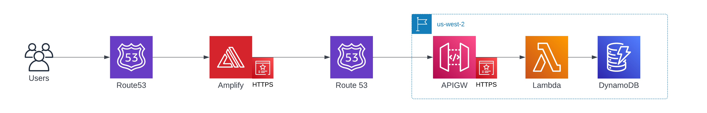

# Question of the Day

 

Question of the Day is a way for you and your friends to answer a unique question a day! You can access the frontend at https://qotd.imranmatin.com and the backend at https://api.qotd.imranmatin.com. For a demo of `Question of the Day` and a guide for how to use it, please see [PRODUCT_DEMO.md](PRODUCT_DEMO.md).

## High Level Architecture

This template was created with React (Frontend), Flask (Backend), DynamoDB (NoSQL Database), Docker (Containers), Terraform (IaC), AWS (3PC), and Github Actions (CI/CD).

  <a href="https://lucid.app/lucidchart/5a757463-c7b5-4d6b-b4eb-70c748055654/edit?viewport_loc=-333%2C-111%2C1906%2C1021%2C0_0&invitationId=inv_39771eda-0235-4904-9bfd-5d9309e4dc12">High Level Architecture Diagram</a>

## Environments

The following environments are available for this app.

- `local`
- ~~`dev`~~
- ~~`alpha`~~
- ~~`beta`~~
- `prod`

## Frontend

The frontend was created using the `create-react-app` CLI. See [frontend/README.md](frontend/README.md) for further details about the fronted.

## Backend

TODO

## Infrastructure

The infrastructure was created using `docker`, `terraform` and `AWS`. See [infra/README.md](infra/README.md) for further details about the infrastructure.

## CI (Build/Test) / CD (Deploy) Pipeline

The CI/CD pipeline was created using `GitHub Actions`. See [.github/workflows/README.md](.github/workflows/README.md) for further details about the CI/CD pipeline.

## Enhancements

- Add test scaffolding (unit, integration, canary, etc.) for frontend/backend.
- Read backend secrets from AWS Secrets Manager rather than from environment variables.
- Convert frontend CI/CD to use Github Actions for build, test, deploy and convert frontend Amplify to manual hosting (i.e. no Git provider connecting and no build, test, deploy in Amplify)
- Add dev/alpha/beta stages
  - Secure dev/alpha/beta/prod stages
  - Create infrastructure
  - Add CI/CD stages using only Github Actions (NOTE: GitHub Actions has a Workflow Visualizer that is the equivalent of a Pipeline Visualizer).
  - Update frontend/backend app code
